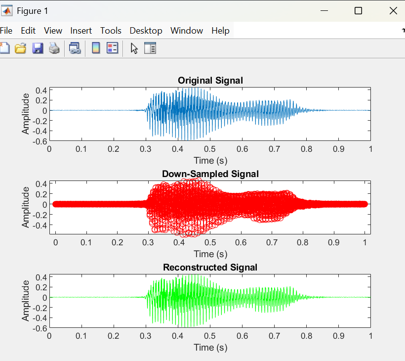
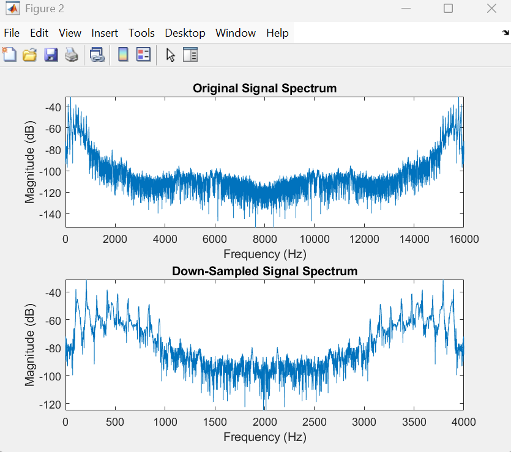

# 🎧 Real-Time & Offline Audio Processing (DSP - MATLAB)

## 📌 Overview
This project implements a **Digital Signal Processing (DSP) based audio system** in MATLAB, capable of handling both real-time and offline audio signals.

It demonstrates how audio signals can be filtered, sampled, reconstructed, and analyzed in both time and frequency domains.

---

## ⚙️ System Architecture
**Microphone / Audio File → Digital Filtering → Downsampling → Reconstruction → Frequency Analysis**

---

## 🔧 Key Features
- Real-time audio processing using microphone input  
- Low-pass and high-pass IIR filter design  
- Sampling rate reduction (downsampling)  
- Signal reconstruction using sinc interpolation  
- Frequency domain analysis using Fast Fourier Transform (FFT)  

---

## 🧠 Engineering Concepts
- Digital Signal Processing (DSP)  
- Sampling Theory & Aliasing  
- IIR Filter Design  
- Sinc Interpolation  
- Fourier Transform (FFT)  

---

## 📊 Results
The system visualizes:
- Original signal (time domain)  
- Downsampled signal  
- Reconstructed signal  
- Frequency spectrum before and after sampling  

### 📷 Sample Outputs
  


---

## 🛠️ Tools & Technologies
- MATLAB  
- Signal Processing Toolbox  
- Audio Toolbox  

---

## 🚀 How to Run
1. Clone the repository  
2. Open MATLAB  
3. Place `voice.wav` in the project folder  
4. Run the script:
   ```matlab
   audio_processing.m
